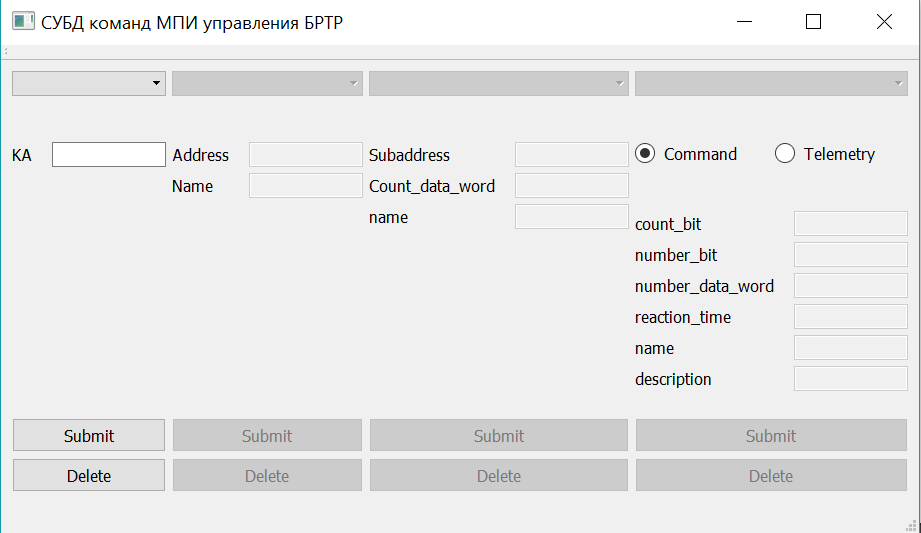
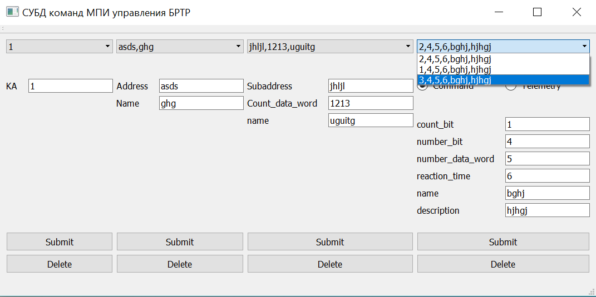

# DataBaseControl

This is a database control system written to automate filling corporate database. 
Developed by me as intern in "Russian Space Systems" and will work for corporate purposes after the future release.
This program is still in development so some features can work incorrectly.

User inteface gives you the ability to add, delete and display information on cosmic vehicles.

# Built With
- [Qt](http://www.qt.io/) - user interface and internal logic
- [SQLite Maestro](https://www.sqlmaestro.com/products/sqlite/maestro/) - used to create a database for this project

# Database 
Database gives user the ability to store information on cosmic vehicles, its systems, subsystems and commands/telemetry data.
  ## Database structure
Contains 5 tables: 
- KA (Kosmic Apparat)
    rows:
    - id
    - ka
- System
    - id
    - id_ka
    - address
    - name
- SubSystem
    - id
    - id_subsystem
    - subaddress
    - count_data_word
    - name
- TMI
    - id
    - id_subsystem
    - number_parameter
    - count_bit
    - number_bit
    - number_data_word
    - name
    - description
- Command
    - id
    - id_subsystem
    - count_bit
    - number_bit
    - number_data_word
    - reaction_time
    - name
    - description
    
# Getting started
These instructions will get you a copy of the project up and running on your local machine for development and testing purposes. See deployment for notes on how to deploy the project on a live system.
This application requires SQLite client(e.g. SQLite Maestro).

## Installing
Create new database with instructions above or just use '.db' file from this repository.
Download and run Qt Creator, download this project, then open '.pro' file, setup your project. 
In your project change path to '.db' file to match the directory you store the database in.
Now you're ready to go!

# Authors
- Dmitry Petukhov - Initial work/founder

# Acknowledgments
  - You can help me to develop this program or to make it better for your puproses 
  - Feel free to make it look the way you like
