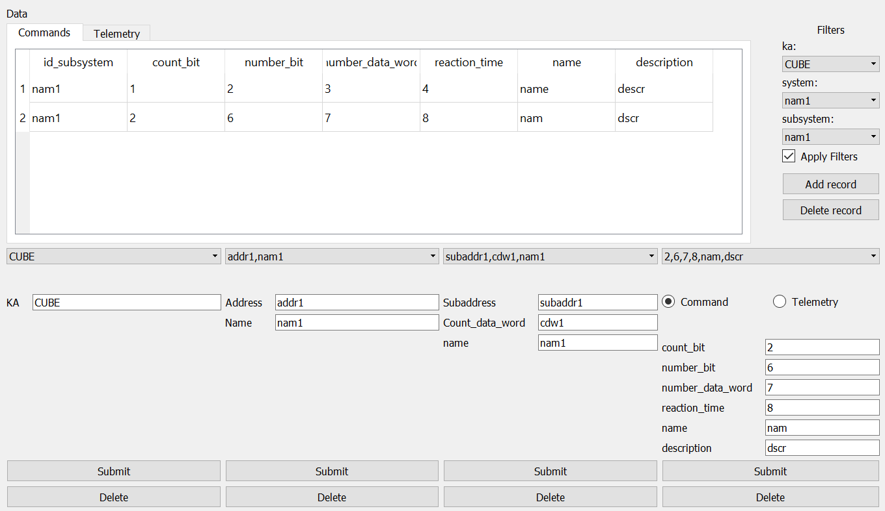

# DataBaseControl

This is a database control system written to automate filling corporate database. 
This is beta version of this application, i still test it and trying to make it better c:

Ka is the main table containing System, containing SubSystem, containing ComTmi. Removal of Ka element entails chain removal of appropriate System, SubSystem and Com/Tmi elements. Similar situation applies to the removal of System and SubSystem elements. Command/TMI tables contain differrent system parametres information.

User inteface gives you the ability to add, delete and display information on cosmic vehicles. From now you can easily add, delete and edit data right from TableView thanks to Qt implementation of model/view data representation.
You can switch between Command and TMI by switching tabs in QTabWidget:

Screenshots provide user with the general look of this application.

# Built With
- [Qt](http://www.qt.io/) - user interface and internal logic
- [SQLite Maestro](https://www.sqlmaestro.com/products/sqlite/maestro/) - used to create a database for this project

# Database 
Database gives user the ability to store information on cosmic vehicles, its systems, subsystems and commands/telemetry data.
  ## Database structure
Contains 5 tables: 
- KA (Kosmic Apparat)
    rows:
    - id - int (not displayed) - foreign key for Systems id_ka
    - ka - String
- System 
    - id - int (not displayed) - foreign key for SubSystems id_subsystem
    - id_ka - int
    - address - String
    - name - String
- SubSystem
    - id - int (not displayed) - foreign key for TMI/Command id_subsystem
    - id_subsystem - int
    - subaddress - String
    - count_data_word - String
    - name - String
- TMI
    - id - int (not displayed)
    - id_subsystem - int
    - number_parameter - int
    - count_bit - int
    - number_bit - int
    - number_data_word - int
    - name - String
    - description - String
- Command
    - id - int (not displayed)
    - id_subsystem - int
    - count_bit - int
    - number_bit - int
    - number_data_word - int
    - reaction_time - int
    - name - String
    - description - String
    
    Please notice that for convenience' sake program displays SubSystem's name in the field id_subsystem of QTableView
# Getting started
These instructions will get you a copy of the project up and running on your local machine for development and testing purposes. See deployment for notes on how to deploy the project on a live system.
This application requires SQLite client(e.g. SQLite Maestro).

## Installing
Create new database with instructions above or just use '.db' file from this repository.
Download and run Qt Creator, download this project, then open '.pro' file, setup your project. 
In your project change path to '.db' file to match the directory you store the database in.
Now you're ready to go!

# Authors
- Dmitry Petukhov - Initial work/founder

# Acknowledgments
  - You can help me to develop this program or to make it better for your puproses 
  - Feel free to make it look the way you like
